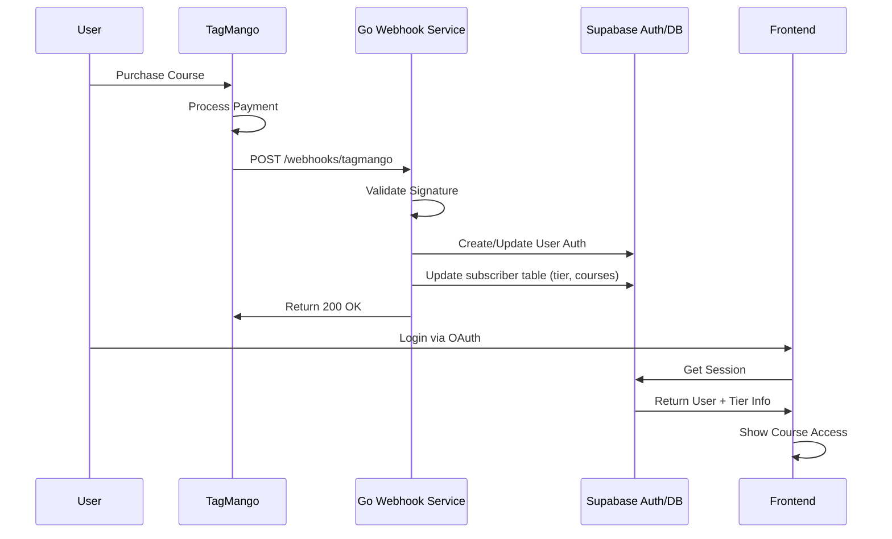
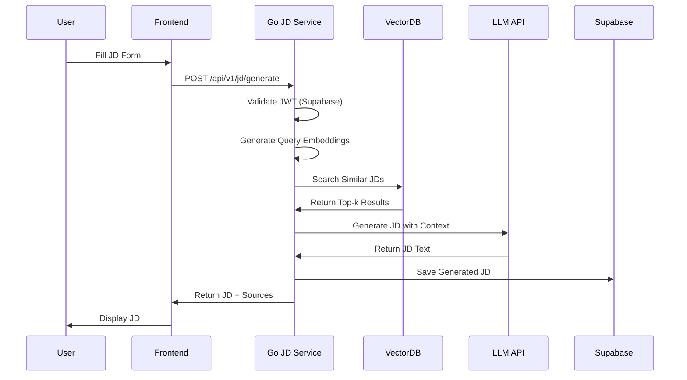
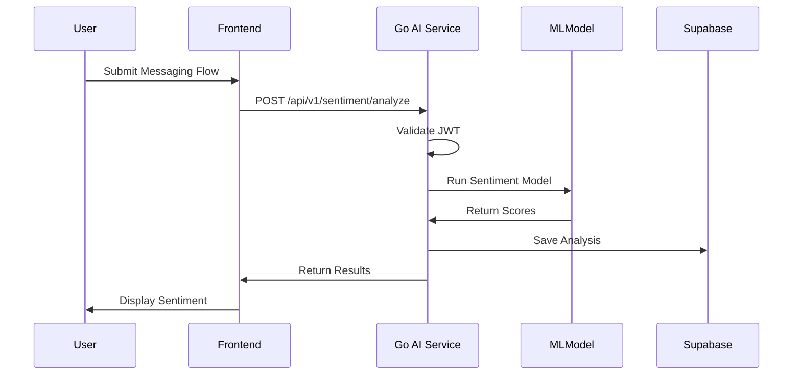

# BestPlay Hub - Technical Architecture
## Hybrid System Design (TagMango + Supabase + Go)

**Last Updated:** 2025-10-15

---

## System Overview

BestPlay Hub uses a hybrid architecture combining:
- **TagMango**: Course purchases & community access tiers
- **Supabase**: OAuth authentication, PostgreSQL database, file storage
- **Go Microservices**: AI/ML tools, RAG-based JD generation, custom ML workloads
- **React Frontend**: User interface (existing codebase)
- **VPS Hosting**: Dedicated server for Go services + domain management via Hostinger

---

## Architecture Diagram

```
┌─────────────────────────────────────────────────────────────────┐
│                         FRONTEND LAYER                           │
│  React + TypeScript + Vite + Tailwind (Existing Codebase)       │
└───────────┬─────────────────────────────────┬──────────────────┘
            │                                 │
            │                                 │
            ▼                                 ▼
┌───────────────────────┐         ┌─────────────────────────────┐
│   SUPABASE BACKEND    │         │   GO MICROSERVICES (VPS)    │
│                       │         │                             │
│ • PostgreSQL DB       │◄────────┤ • TagMango Webhook Handler  │
│ • Auth (OAuth)        │         │ • AI Tools Service          │
│ • Storage             │         │ • JD Generator (RAG)        │
│ • Edge Functions      │         │ • Custom ML Models          │
│   (Simple ops)        │         │ • Sentiment Analysis        │
└───────────┬───────────┘         └──────────┬──────────────────┘
            │                                │
            │                                │
            ▼                                ▼
┌───────────────────────┐         ┌─────────────────────────────┐
│   TAGMANGO PLATFORM   │         │   VPS INFRASTRUCTURE        │
│                       │         │                             │
│ • Course Management   │         │ • Hostinger VPS             │
│ • Payment Processing  │         │ • Domain Management         │
│ • Community Tiers     │         │ • Go Services Deployment    │
│ • Webhooks            │─────────┤ • Vector DB (RAG)           │
└───────────────────────┘         └─────────────────────────────┘
```

---

## Component Breakdown

### 1. Frontend Layer (React/TypeScript)
**Status:** Existing codebase
**Responsibilities:**
- User interface for all features
- OAuth login flows (via Supabase)
- Real-time updates (Supabase realtime)
- API calls to both Supabase and Go services

**Key Pages:**
- `/landing` - Public landing page
- `/auth` - Login/signup (Supabase OAuth)
- `/dashboard` - User dashboard with stats
- `/ai-tools` - AI tool launcher
- `/contests` - Challenge submissions
- `/calendar` - Event management
- `/training` - Course access (TagMango integration)

---

### 2. TagMango Integration
**Purpose:** Course purchases & community access management

#### User Flow:
1. User purchases course/tier on TagMango
2. TagMango sends webhook to Go service
3. Go service processes webhook:
   - Validates signature
   - Creates/updates user in Supabase Auth
   - Updates `subscriber` table with tier info
   - Grants appropriate access permissions

#### Webhook Payload (Expected):
```json
{
  "event": "course_purchase",
  "user": {
    "email": "user@example.com",
    "name": "John Doe",
    "phone": "+1234567890"
  },
  "course": {
    "id": "course_123",
    "name": "Advanced Recruiting Strategies",
    "tier": "premium"
  },
  "transaction": {
    "id": "txn_456",
    "amount": 9900,
    "currency": "INR"
  },
  "timestamp": "2025-10-15T10:30:00Z"
}
```

#### Database Schema Updates Needed:
```sql
-- Add to subscriber table
ALTER TABLE subscriber 
ADD COLUMN tagmango_user_id TEXT,
ADD COLUMN access_tier TEXT DEFAULT 'free',
ADD COLUMN tier_expires_at TIMESTAMP WITH TIME ZONE,
ADD COLUMN courses_purchased JSONB DEFAULT '[]'::jsonb;

-- Create index for quick lookups
CREATE INDEX idx_subscriber_tagmango_id ON subscriber(tagmango_user_id);
```

---

### 3. Supabase Backend
**Purpose:** Core data persistence, auth, storage

#### Kept in Supabase:
- **Authentication:** OAuth providers (Google, GitHub, etc.)
- **Database:** PostgreSQL tables (subscriber, challenges, calendar_events, etc.)
- **Storage:** File uploads (avatars, documents)
- **Simple Edge Functions:** Basic CRUD operations, simple validations

#### Why Keep Supabase:
- Excellent OAuth integration
- Real-time subscriptions
- Built-in RLS (Row Level Security)
- Managed PostgreSQL
- Auto-generated TypeScript types

---

### 4. Go Microservices (VPS)
**Purpose:** Heavy AI/ML workloads, RAG, custom logic

#### Service Architecture:

```
go-services/
├── cmd/
│   ├── tagmango-webhook/     # Webhook handler
│   ├── ai-tools-api/          # AI tools service
│   └── jd-generator/          # Job description generator
├── internal/
│   ├── auth/                  # JWT validation (Supabase)
│   ├── db/                    # PostgreSQL client
│   ├── ml/                    # ML model interfaces
│   ├── rag/                   # RAG pipeline
│   └── tagmango/              # TagMango client
├── pkg/
│   ├── sentiment/             # Sentiment analysis
│   └── embeddings/            # Vector embeddings
├── config/
│   └── config.yaml            # Configuration
├── docker-compose.yml
└── go.mod
```

#### Services Detail:

##### 4.1 TagMango Webhook Handler
**Endpoint:** `POST /webhooks/tagmango`
**Responsibilities:**
- Validate TagMango webhook signatures
- Create users in Supabase Auth
- Update subscriber table with tier info
- Send confirmation emails

**Tech Stack:**
- `fiber` or `gin` for HTTP server
- `supabase-go` client for DB operations
- Redis for rate limiting

##### 4.2 AI Tools Service
**Endpoints:**
- `POST /api/v1/sentiment/analyze` - Sentiment analysis (replaces Supabase edge function)
- `POST /api/v1/search-strategy/generate` - Search strategy (replaces Supabase edge function)

**Tech Stack:**
- Custom ML models (TensorFlow, PyTorch via CGO or gRPC to Python)
- HTTP server (Fiber/Gin)
- Connection pool to PostgreSQL

##### 4.3 JD Generator with RAG
**Endpoint:** `POST /api/v1/jd/generate`

**Request:**
```json
{
  "job_title": "Senior Software Engineer",
  "company_name": "TechCorp",
  "location": "Remote",
  "experience_level": "5-8 years",
  "skills": ["Go", "Python", "Kubernetes"],
  "industry": "SaaS",
  "custom_requirements": "Must have experience with microservices"
}
```

**Response:**
```json
{
  "job_description": "...",
  "sections": {
    "overview": "...",
    "responsibilities": [...],
    "requirements": [...],
    "nice_to_have": [...],
    "benefits": [...]
  },
  "rag_sources": [
    {
      "source": "Best practices for SaaS recruiting",
      "relevance_score": 0.89
    }
  ]
}
```

**RAG Pipeline:**
1. User inputs job parameters
2. Generate embeddings for query
3. Search vector DB for similar JD templates
4. Retrieve top-k relevant documents
5. Pass to LLM with context
6. Generate structured JD
7. Return with sources

**Tech Stack:**
- Vector DB: `Qdrant` or `Weaviate` (self-hosted on VPS)
- Embeddings: `sentence-transformers` via Python service or `all-MiniLM-L6-v2`
- LLM: OpenAI API or Lovable AI Gateway
- Go packages: `go-openai`, vector DB clients

---

## Data Flow Examples

### Flow 1: User Purchases Course on TagMango



### Flow 2: Generate Job Description with RAG



### Flow 3: AI Sentiment Analysis



---

## Authentication & Authorization

### Supabase JWT Validation in Go

```go
package auth

import (
    "crypto/rsa"
    "encoding/base64"
    "encoding/json"
    "fmt"
    "github.com/golang-jwt/jwt/v5"
    "net/http"
)

type SupabaseValidator struct {
    publicKey *rsa.PublicKey
    projectID string
}

func NewSupabaseValidator(projectID string) (*SupabaseValidator, error) {
    // Fetch JWKS from Supabase
    jwksURL := fmt.Sprintf("https://%s.supabase.co/auth/v1/jwks", projectID)
    // Parse public key
    // ...
    return &SupabaseValidator{
        publicKey: publicKey,
        projectID: projectID,
    }, nil
}

func (v *SupabaseValidator) ValidateToken(tokenString string) (*jwt.Token, error) {
    token, err := jwt.Parse(tokenString, func(token *jwt.Token) (interface{}, error) {
        if _, ok := token.Method.(*jwt.SigningMethodRSA); !ok {
            return nil, fmt.Errorf("unexpected signing method")
        }
        return v.publicKey, nil
    })
    return token, err
}
```

### Access Control by Tier

```go
func (h *Handler) RequireTier(tier string) gin.HandlerFunc {
    return func(c *gin.Context) {
        userTier := c.GetString("user_tier")
        if !hasAccess(userTier, tier) {
            c.JSON(http.StatusForbidden, gin.H{"error": "Insufficient access tier"})
            c.Abort()
            return
        }
        c.Next()
    }
}

// Route example
r.POST("/api/v1/jd/generate", 
    authMiddleware,
    RequireTier("premium"),
    generateJDHandler)
```

---

## Database Schema Extensions

### New Tables for Go Services

```sql
-- JD Generation History
CREATE TABLE jd_generation_history (
    id UUID PRIMARY KEY DEFAULT gen_random_uuid(),
    user_id UUID NOT NULL REFERENCES subscriber(id),
    job_title TEXT NOT NULL,
    company_name TEXT,
    generated_jd TEXT NOT NULL,
    rag_sources JSONB,
    created_at TIMESTAMP WITH TIME ZONE DEFAULT NOW(),
    updated_at TIMESTAMP WITH TIME ZONE DEFAULT NOW()
);

CREATE INDEX idx_jd_history_user ON jd_generation_history(user_id);

-- AI Tool Usage Tracking
CREATE TABLE ai_tool_usage (
    id UUID PRIMARY KEY DEFAULT gen_random_uuid(),
    user_id UUID NOT NULL REFERENCES subscriber(id),
    tool_name TEXT NOT NULL,
    request_payload JSONB,
    response_payload JSONB,
    processing_time_ms INTEGER,
    created_at TIMESTAMP WITH TIME ZONE DEFAULT NOW()
);

CREATE INDEX idx_usage_user_tool ON ai_tool_usage(user_id, tool_name);
CREATE INDEX idx_usage_created ON ai_tool_usage(created_at DESC);

-- TagMango Transactions
CREATE TABLE tagmango_transactions (
    id UUID PRIMARY KEY DEFAULT gen_random_uuid(),
    tagmango_user_id TEXT NOT NULL,
    tagmango_txn_id TEXT UNIQUE NOT NULL,
    subscriber_id UUID REFERENCES subscriber(id),
    course_id TEXT,
    course_name TEXT,
    tier TEXT,
    amount INTEGER,
    currency TEXT,
    webhook_payload JSONB,
    processed_at TIMESTAMP WITH TIME ZONE DEFAULT NOW()
);

CREATE INDEX idx_tagmango_user ON tagmango_transactions(tagmango_user_id);
CREATE INDEX idx_tagmango_subscriber ON tagmango_transactions(subscriber_id);
```

---

## VPS Deployment Architecture

### Infrastructure Setup (Hostinger VPS)

#### Server Specifications (Recommended):
- **CPU:** 4+ cores
- **RAM:** 8GB+ (for ML models)
- **Storage:** 100GB+ SSD
- **OS:** Ubuntu 22.04 LTS

#### Services on VPS:

1. **Go Services** (Docker Containers)
   - TagMango Webhook Handler
   - AI Tools API
   - JD Generator

2. **Vector Database** (Qdrant/Weaviate)
   - Self-hosted for RAG

3. **Redis** (Optional)
   - Caching layer
   - Rate limiting
   - Session management

4. **Nginx**
   - Reverse proxy
   - SSL termination (Let's Encrypt)
   - Load balancing

#### Docker Compose Example:

```yaml
version: '3.8'

services:
  tagmango-webhook:
    build: ./cmd/tagmango-webhook
    ports:
      - "8080:8080"
    environment:
      - SUPABASE_URL=https://nclaesdxpwhfgkrnactl.supabase.co
      - SUPABASE_SERVICE_KEY=${SUPABASE_SERVICE_KEY}
      - TAGMANGO_SECRET=${TAGMANGO_SECRET}
    restart: unless-stopped

  ai-tools-api:
    build: ./cmd/ai-tools-api
    ports:
      - "8081:8081"
    volumes:
      - ./models:/models
    environment:
      - SUPABASE_URL=https://nclaesdxpwhfgkrnactl.supabase.co
      - SUPABASE_ANON_KEY=${SUPABASE_ANON_KEY}
      - OPENAI_API_KEY=${OPENAI_API_KEY}
    restart: unless-stopped

  jd-generator:
    build: ./cmd/jd-generator
    ports:
      - "8082:8082"
    depends_on:
      - qdrant
    environment:
      - VECTOR_DB_URL=http://qdrant:6333
      - LOVABLE_API_KEY=${LOVABLE_API_KEY}
    restart: unless-stopped

  qdrant:
    image: qdrant/qdrant:latest
    ports:
      - "6333:6333"
    volumes:
      - qdrant_storage:/qdrant/storage
    restart: unless-stopped

  nginx:
    image: nginx:alpine
    ports:
      - "80:80"
      - "443:443"
    volumes:
      - ./nginx.conf:/etc/nginx/nginx.conf
      - /etc/letsencrypt:/etc/letsencrypt
    depends_on:
      - tagmango-webhook
      - ai-tools-api
      - jd-generator
    restart: unless-stopped

volumes:
  qdrant_storage:
```

#### Nginx Configuration:

```nginx
upstream tagmango_webhook {
    server tagmango-webhook:8080;
}

upstream ai_tools {
    server ai-tools-api:8081;
}

upstream jd_generator {
    server jd-generator:8082;
}

server {
    listen 80;
    server_name api.bestplayhub.com;
    return 301 https://$server_name$request_uri;
}

server {
    listen 443 ssl http2;
    server_name api.bestplayhub.com;

    ssl_certificate /etc/letsencrypt/live/api.bestplayhub.com/fullchain.pem;
    ssl_certificate_key /etc/letsencrypt/live/api.bestplayhub.com/privkey.pem;

    location /webhooks/ {
        proxy_pass http://tagmango_webhook;
        proxy_set_header Host $host;
        proxy_set_header X-Real-IP $remote_addr;
    }

    location /api/v1/sentiment/ {
        proxy_pass http://ai_tools;
        proxy_set_header Host $host;
        proxy_set_header Authorization $http_authorization;
    }

    location /api/v1/jd/ {
        proxy_pass http://jd_generator;
        proxy_set_header Host $host;
        proxy_set_header Authorization $http_authorization;
    }
}
```

---

## Frontend Integration Changes

### API Client Configuration

```typescript
// src/lib/api-client.ts
import { supabase } from "@/integrations/supabase/client";

const GO_API_BASE_URL = import.meta.env.VITE_GO_API_URL || "https://api.bestplayhub.com";

export class GoAPIClient {
  private static async getAuthHeaders(): Promise<HeadersInit> {
    const { data: { session } } = await supabase.auth.getSession();
    return {
      'Content-Type': 'application/json',
      'Authorization': `Bearer ${session?.access_token || ''}`,
    };
  }

  static async generateJD(params: JDParams): Promise<JDResponse> {
    const headers = await this.getAuthHeaders();
    const response = await fetch(`${GO_API_BASE_URL}/api/v1/jd/generate`, {
      method: 'POST',
      headers,
      body: JSON.stringify(params),
    });
    
    if (!response.ok) {
      throw new Error(`JD generation failed: ${response.statusText}`);
    }
    
    return response.json();
  }

  static async analyzeSentiment(data: SentimentParams): Promise<SentimentResponse> {
    const headers = await this.getAuthHeaders();
    const response = await fetch(`${GO_API_BASE_URL}/api/v1/sentiment/analyze`, {
      method: 'POST',
      headers,
      body: JSON.stringify(data),
    });
    
    if (!response.ok) {
      throw new Error(`Sentiment analysis failed: ${response.statusText}`);
    }
    
    return response.json();
  }
}
```

### Environment Variables

```env
# .env (frontend)
VITE_SUPABASE_URL=https://nclaesdxpwhfgkrnactl.supabase.co
VITE_SUPABASE_PUBLISHABLE_KEY=eyJhbGci...
VITE_GO_API_URL=https://api.bestplayhub.com
```

---

## Migration Strategy

### Phase 1: Setup Infrastructure (Week 1-2)
- [ ] Provision VPS from Hostinger
- [ ] Configure domain (api.bestplayhub.com)
- [ ] Set up SSL certificates (Let's Encrypt)
- [ ] Install Docker, Docker Compose
- [ ] Deploy Nginx reverse proxy

### Phase 2: TagMango Integration (Week 2-3)
- [ ] Build Go webhook handler
- [ ] Update Supabase schema (subscriber table)
- [ ] Configure TagMango webhooks
- [ ] Test course purchase flow
- [ ] Deploy to VPS

### Phase 3: Migrate AI Tools to Go (Week 3-5)
- [ ] Build AI Tools API service
- [ ] Migrate `calculate-sentiment` from Supabase Edge Function
- [ ] Migrate `search-strategy` from Supabase Edge Function
- [ ] Update frontend to call Go API
- [ ] Test and validate
- [ ] Deprecate old Edge Functions

### Phase 4: JD Generator with RAG (Week 5-8)
- [ ] Set up Qdrant vector database
- [ ] Build embedding pipeline
- [ ] Collect and embed JD templates
- [ ] Build Go JD generator service
- [ ] Create frontend UI for JD generation
- [ ] Test RAG retrieval quality
- [ ] Deploy to production

### Phase 5: Optimization & Monitoring (Week 8+)
- [ ] Set up monitoring (Prometheus/Grafana)
- [ ] Implement logging (Loki or ELK)
- [ ] Performance tuning
- [ ] Cost optimization
- [ ] Documentation

---

## Security Considerations

### 1. API Authentication
- All Go services validate Supabase JWT tokens
- TagMango webhook validates signature
- Rate limiting on all endpoints

### 2. Database Access
- Go services use read-only credentials where possible
- Supabase RLS policies remain enforced
- No direct SQL from frontend

### 3. Secrets Management
- Use environment variables (Docker secrets)
- Never commit secrets to Git
- Rotate API keys regularly

### 4. HTTPS/TLS
- All communication over HTTPS
- SSL termination at Nginx
- Certificate auto-renewal (certbot)

---

## Monitoring & Logging

### Metrics to Track:
- API latency (p50, p95, p99)
- Error rates by endpoint
- AI model inference time
- Database query performance
- Vector DB search latency
- TagMango webhook delivery rate

### Logging Strategy:
- Structured JSON logs
- Centralized logging (ship to external service or self-host Loki)
- Error tracking (Sentry or similar)
- Audit logs for sensitive operations

---

## Cost Estimation

### Monthly Costs (Approximate):

| Service | Cost (USD) |
|---------|-----------|
| Hostinger VPS (8GB RAM) | $15-30 |
| Domain (bestplayhub.com) | $1-2 |
| SSL Certificate | Free (Let's Encrypt) |
| Supabase (Free tier) | $0 |
| OpenAI API (moderate usage) | $50-100 |
| Lovable AI Gateway | $20-50 |
| TagMango Platform | Variable |
| **Total** | **~$100-200/month** |

---

## Next Steps

1. **Confirm TagMango API details** - Get webhook documentation, test credentials
2. **Provision VPS** - Set up Hostinger VPS and domain
3. **Design JD RAG dataset** - Collect sample JDs for embedding
4. **Prototype webhook handler** - Build minimal TagMango integration
5. **Set up CI/CD** - Automate Go service deployments

---

## Questions to Address

1. **TagMango Specifics:**
   - What webhook events does TagMango support?
   - What's the webhook payload format?
   - How do we handle refunds/cancellations?

2. **ML Models:**
   - Which custom ML models do you need?
   - Do you have trained models, or need to train them?
   - What's the expected inference latency?

3. **RAG Dataset:**
   - Do you have existing JD templates to embed?
   - How many documents (order of magnitude)?
   - Update frequency for the vector DB?

4. **Access Tiers:**
   - What are the exact tier names from TagMango?
   - What features are unlocked per tier?
   - How do we handle tier downgrades?

---

**Document Status:** Draft for Review  
**Next Review:** After VPS provisioning and TagMango API access
